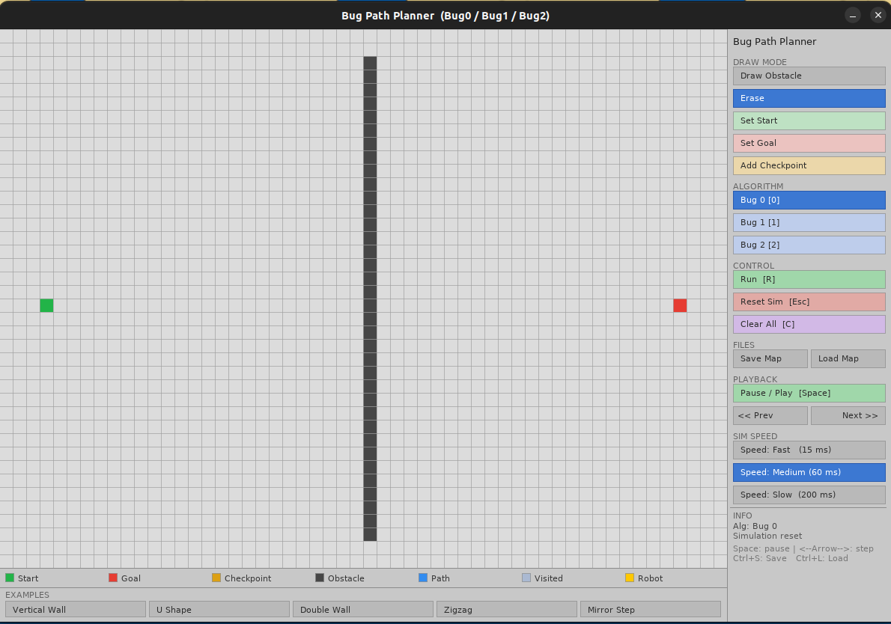
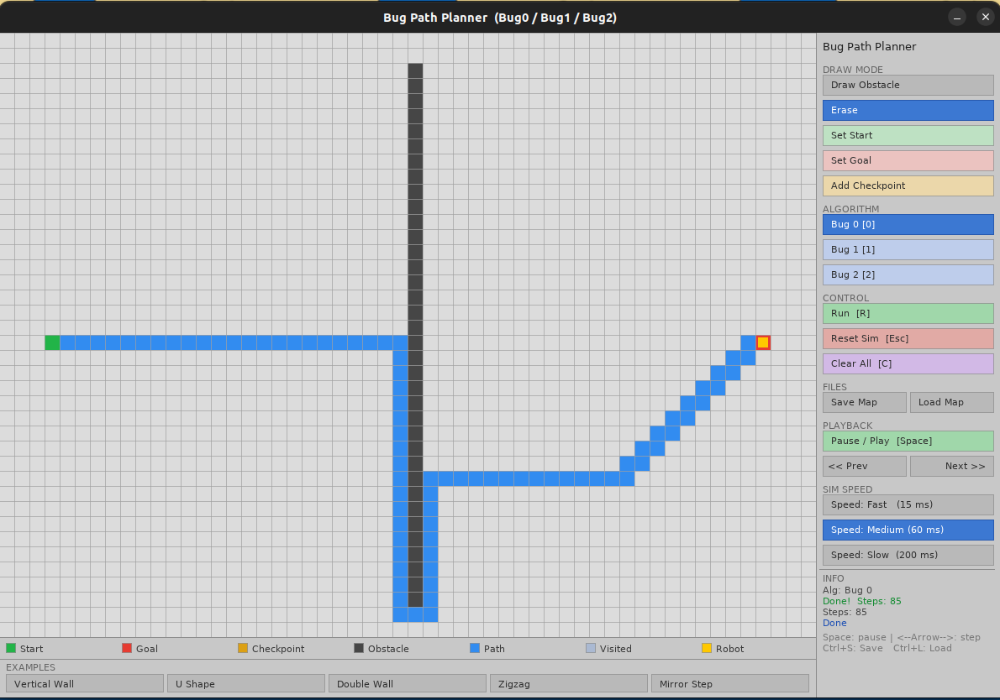
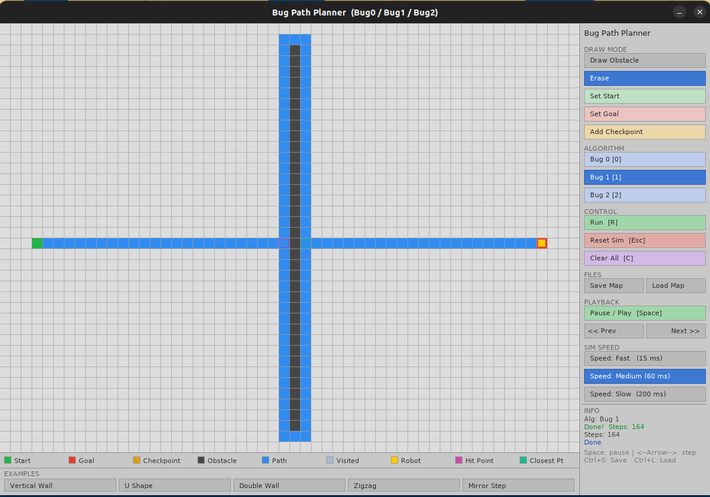
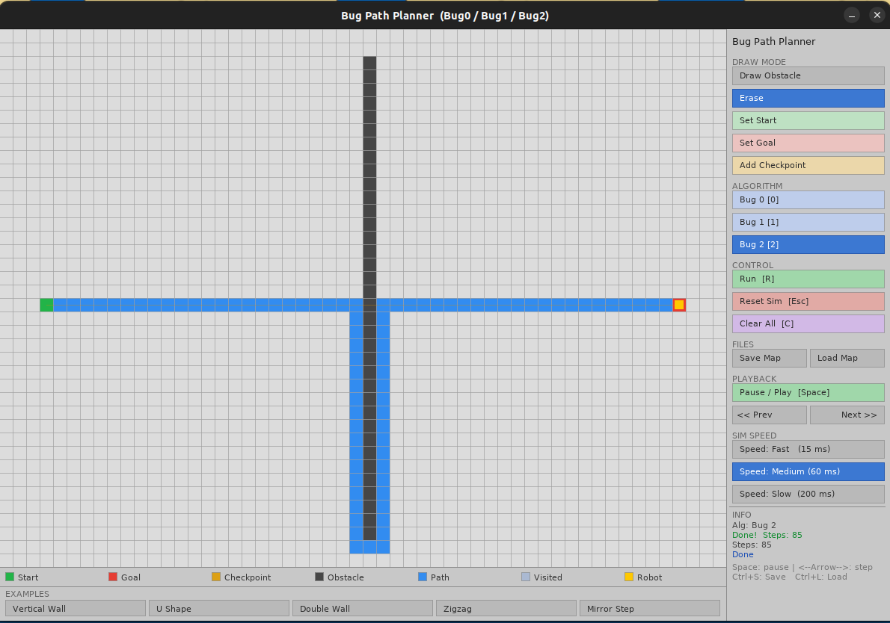

# Bug Path Planner

An interactive, grid-based visualiser for the **Bug0**, **Bug1**, and **Bug2** path-planning algorithms, built with C++17 and SDL2.

---

## Screenshots

### Editor - vertical wall map loaded


### Bug 0 - done in 85 steps


### Bug 1 - done in 164 steps (full circumnavigation)


### Bug 2 - done in 85 steps (M-line exit)


---

## Features

- Paint obstacle walls, set a start and goal, and optionally add ordered checkpoints.
- Watch the robot navigate in real time at three configurable speeds (15 ms / 60 ms / 200 ms).
- Step forward and backward through the simulation one tick at a time.
- Switch between Bug0 / Bug1 / Bug2 without rebuilding - sidebar buttons or keys `0` / `1` / `2`.
- Save and load maps as plain-text `.map` files via a native file dialog (zenity).
- Five built-in example maps loadable from the sidebar.
- Bug2 M-line overlay rendered on the grid.
- Bug1 hit-point (magenta) and closest-point (teal) debug markers rendered on the grid.
- Full path painted on completion; visited cells shown in a distinct colour during traversal.
- Checkpoint support: add ordered waypoints the robot must visit before the goal.

---

## Algorithms

### Bug 0
Greedy move directly toward the goal. On hitting an obstacle, enter left-hand
wall-follow. Exit wall-follow only after making net progress past the
wall-follow entry point (current distance to goal < entry distance) **and**
a direction with positive goal-progress is free (one-step lookahead).
This prevents oscillation inside concave obstacles such as U-shapes.

### Bug 1
On hitting an obstacle, fully circumnavigate it while recording the closest
cell to the goal (*closePt*). After the full circuit, retrace the boundary
back to *closePt* and resume direct travel toward the goal. Guaranteed to
find a path if one exists, at the cost of more steps than Bug0/Bug2.

### Bug 2
Defines an **M-line** - the straight line from the current segment start to the
goal. On hitting an obstacle, follow the wall and exit as soon as the robot
crosses the M-line at a point closer to the goal than the hit point. If the
robot returns to the hit point without such a crossing, the goal is declared
unreachable.

---

## Building

### Dependencies

| Library        | Ubuntu / Debian package          |
|----------------|----------------------------------|
| SDL2           | `libsdl2-dev`                    |
| SDL2\_ttf      | `libsdl2-ttf-dev`                |
| CMake ≥ 3.16   | `cmake`                          |
| zenity         | `zenity`                         |

```bash
sudo apt install libsdl2-dev libsdl2-ttf-dev cmake zenity
```

### Build

```bash
mkdir build && cd build
cmake ..
make -j$(nproc)
./bug_planner
```

Example maps are automatically copied into `build/maps/` by the CMake post-build step.

---

## Usage

### Mouse

| Action                        | Effect                        |
|-------------------------------|-------------------------------|
| Left-click / drag on grid     | Apply the selected draw mode  |
| Right-click / drag on grid    | Erase cell                    |
| Click a sidebar button        | Activate that mode or action  |

### Keyboard

| Key              | Action                          |
|------------------|---------------------------------|
| `R`              | Run simulation                  |
| `Esc`            | Reset simulation                |
| `C`              | Clear all                       |
| `Space`          | Pause / resume                  |
| `<-` / `->`        | Step backward / forward         |
| `0` / `1` / `2` | Select Bug0 / Bug1 / Bug2       |
| `Ctrl+S`         | Save map                        |
| `Ctrl+L`         | Load map                        |

### Draw Modes

| Mode            | Effect                                                      |
|-----------------|-------------------------------------------------------------|
| Draw Obstacle   | Paint obstacle cells                                        |
| Erase           | Remove any cell (obstacle, start, goal, checkpoint)         |
| Set Start       | Place the robot's start position (one per map)              |
| Set Goal        | Place the goal position (one per map)                       |
| Add Checkpoint  | Append an ordered waypoint the robot must visit first       |

---

## Map File Format (.map)

Plain-text, one record per line:

```
# comment
S x y    # start position
G x y    # goal position
K x y    # checkpoint (ordered, may repeat)
O x y    # obstacle cell
```

---

## Project Structure

```
bug-nav-cpp-sim/
├── include/
│   ├── constants.hpp     
│   ├── direction.hpp     
│   ├── button.hpp        
│   ├── grid.hpp          
│   ├── robot.hpp         
│   ├── mapfile.hpp       
│   ├── theme.hpp         
│   └── app.hpp           
├── src/
│   ├── main.cpp          # Entry point
│   ├── grid.cpp
│   ├── mapfile.cpp
│   ├── robot.cpp
│   ├── bug0.cpp
│   ├── bug1.cpp
│   ├── bug2.cpp
│   ├── app.cpp
│   ├── app_events.cpp
│   ├── app_editor.cpp
│   ├── app_ui.cpp
│   ├── app_sim.cpp
│   ├── app_map.cpp
│   └── app_render.cpp
├── maps/
│   ├── vertical_wall.map
│   ├── u_shape.map
│   ├── double_wall.map
│   ├── corridor.map
│   ├── zigzag.map
│   └── mirror_step.map
├── assets/
│   ├── wall.png
│   ├── wall_b0.png
│   ├── wall_b1.png
│   └── wall_b2.png
├── docs/
│   ├── Doxyfile
│   └── DoxygenLayout.xml
├── CMakeLists.txt
└── README.md
```

---

## Generating Documentation

```bash
doxygen docs/Doxyfile
```

HTML output is written to `docs/html/index.html`.
